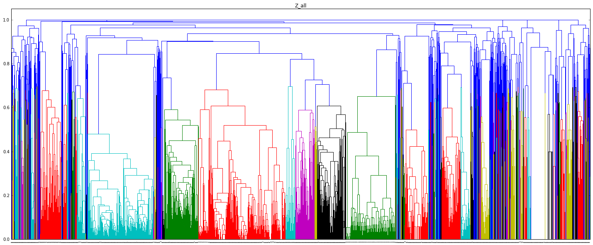

# senato.py #

**Automated Clustering of Similar Amendments in the Italian Senate**

## The problem ##

The Italian Senate is under a Denial-of-Service attack.
Software is being used to generate millions of amendments to block the passing of certain laws.
The amendments are generated using a black-hat technique that produces several variations of a given text.
This puts a huge strain on the Senate, which has to discuss and vote on the individual amendments, effectively bringing proceedings to a standstill.

## The solution ##

The Italian Senate makes its data available publicly.
An automated clustering analysis can be performed on these data to eliminate what are essentially duplicate amendments and reduce the total number of amendments that have to be considered.

senato.py is a scraper for data from the Senate.
The data can be analysed using the Jupyter notebook provided in this repository.

## Installation and Usage ##

1. Clone this repository: `git clone https://github.com/jacquerie/senato.py.git`
2. Install the dependencies: `cd senato.py && pip install -r requirements.txt`
3. Create a folder for the amendments: `mkdir data`
4. Fetch the amendments by running the scraper: `scrapy crawl senato`
5. Examine the analysis by running the notebook: `jupyter notebook analysis.ipynb`

## About senato.py ##

senato.py is authored by Jacopo Notarstefano [(@Jaconotar)](https://twitter.com/Jaconotar).
You can learn more about it by watching [this short "lightning talk" given by Jacopo at CERN on 17 June 2016](https://cds.cern.ch/record/2161770).

## License ##

MIT
